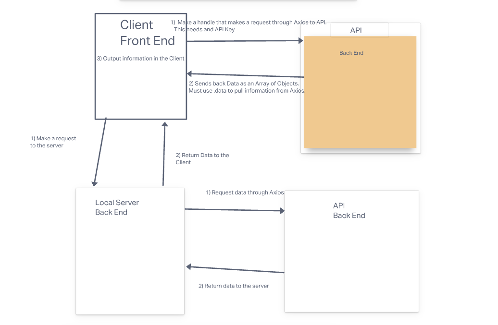
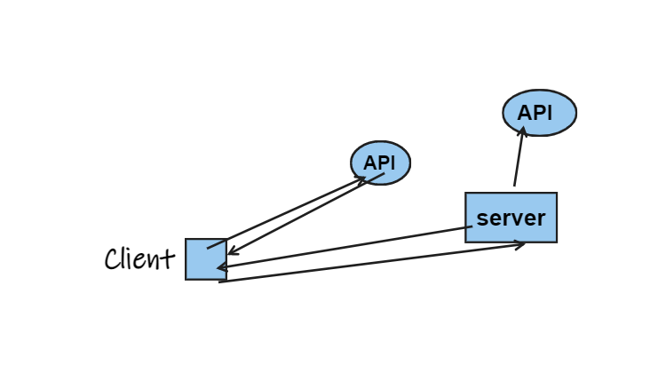
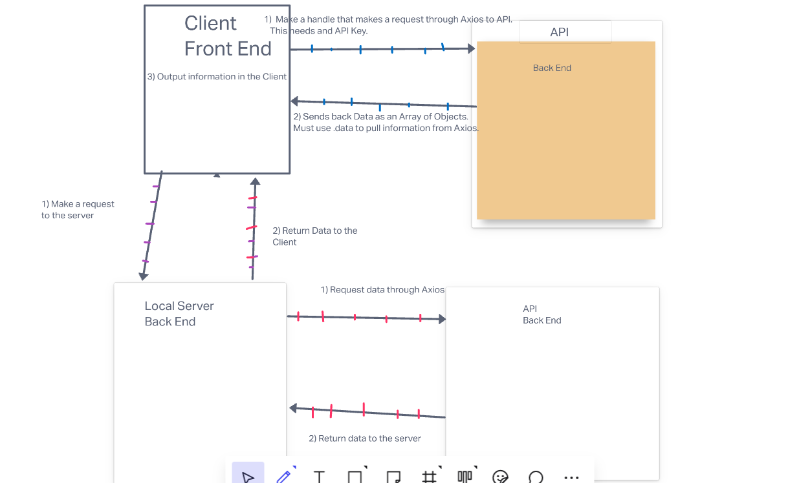
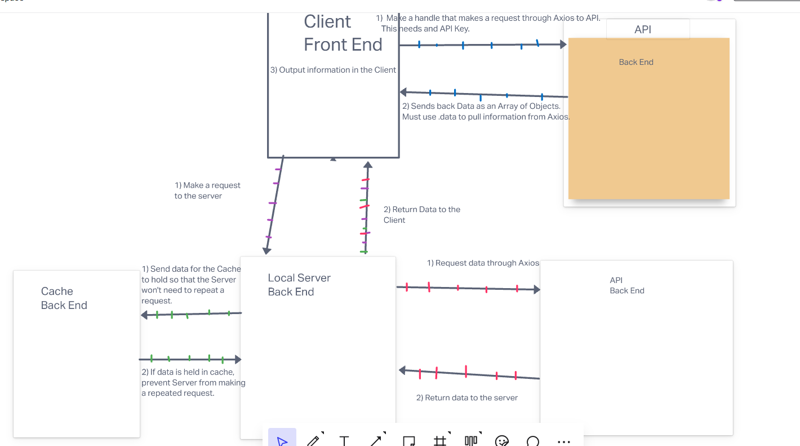

# Project Name City Explorer

**Author**: Miguel Rodriguez
**Version**: 2.0.0 

## Overview

This really cool website lets you see the current weather as well as see movies that fit the city name. 

## Architecture

Built using React, Bootstrap, and Axios. 

## Change Log

Last added feature was weather.js
added some bootstrap cards.
Also fixed a handlesubmit bug
Modulated Back endserver

## Credit and Collaborations

collabed with Jordan Yamda.

Name of feature: Bootstrap and Weather API

Estimate of time needed to complete: 2 hour

Start time: 5 PM

Finish time: 8 PM

Actual time needed to complete: 3 hours

## Lab 7-10
Name of feature: Bootstrap, Weather and Movie API, Refactor 

Estimate of time needed to complete: 2 hour

Start time: 12 PM

Finish time: 9 PM

Actual time needed to complete: 4 Days

